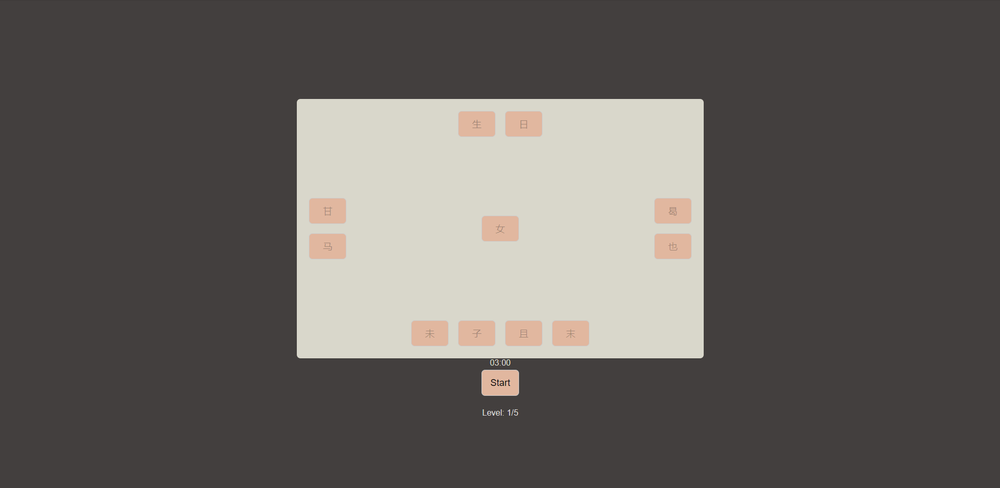

# [Match Box Game](https://youtu.be/Ljiz4_2x_G0)
- Demo: https://lebaohung.github.io/match-box-left-right/

In this tutorial, you will learn how to create a match card memory game using Match Box Games! You will learn how to randomly place cards onto the board and create click handlers for selecting two cards and checking if they match.

